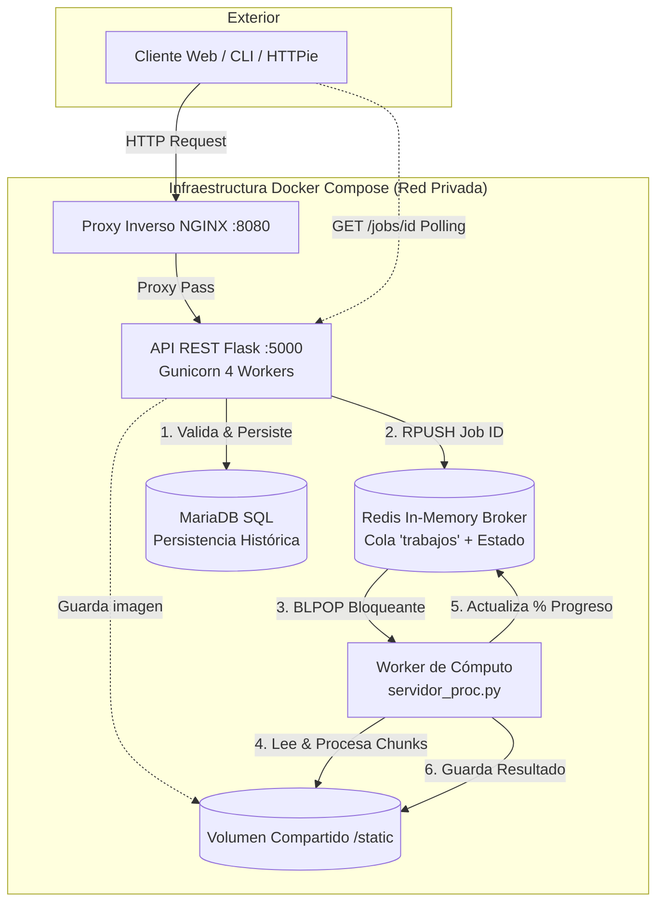

# 🌐 Distributed Systems & Cloud Architecture Portfolio
> **Asignatura:** Sistemas Distribuidos | Grado en Ciencia e Ingeniería de Datos  
> **Autores:** [Adrián Manso Martínez](https://github.com/adriimaa) & Yonathan Patricio Torrejón Martínez  
> **Memoria Completa:** [📄 Ver Documentación Técnica Oficial (79 páginas PDF)](./docs/Memoria_Sistemas_Distribuidos.pdf)


---

## 📌 Resumen del Repositorio

Este repositorio recoge la evolución completa en el diseño, desarrollo y despliegue de **sistemas distribuidos, protocolos de red, arquitecturas orientadas a eventos y microservicios contenerizados**.

El código abarca desde la implementación de protocolos fiables sobre capas de transporte (UDP/TCP) hasta la arquitectura de producción de un **sistema distribuido de procesamiento asíncrono de tareas pesadas orquestado con Docker Compose (Proyecto Estrella P5)**.

---

## 🚀 PROYECTO ESTRELLA: Pipeline Distribuido de Procesamiento Asíncrono ([Directorio P5](./P5))

Sistema desacoplado basado en el patrón **Productor-Consumidor (Task Queue)** para procesar transformaciones intensivas de imágenes en CPU de manera asíncrona y escalable.

### 📐 Diagrama de Arquitectura



### ⚙️ Características Técnicas Principales
* **Desacoplamiento Total:** La API responde en milisegundos (`201 Created` con UUID) y delega la computación pesada a una cola en memoria.
* **Productor-Consumidor con Redis:** Utiliza `RPUSH` y `BLPOP` bloqueante para balanceo automático de carga sin consumo inútil de ciclos de CPU.
* **Paralelismo Real en CPU:** El *Worker* divide las matrices de imagen con **NumPy** en bloques (*chunks*) y utiliza `ProcessPoolExecutor` para evitar el GIL (Global Interpreter Lock) de Python, exprimiendo todos los núcleos del procesador.
* **Tracking de Progreso en Tiempo Real:** El estado de cada trabajo (`queued` ➔ `processing` ➔ `finished` / `failed`) y su porcentaje (`0%` a `100%`) se actualizan dinámicamente en Redis.
* **Persistencia Transaccional:** Registro permanente de metadatos en **MariaDB** mediante **SQLAlchemy**.
* **Seguridad y Proxy Inverso:** Enrutamiento a través de **NGINX**, cabeceras CORS habilitadas y autenticación HTTP Basic con contraseñas cifradas mediante Hashing (`Werkzeug`).

### ⚡ Cómo Ejecutarlo en 1 Comando
```bash
# Clonar el repositorio
git clone https://github.com/adriimaa/sd-pl2-g14.git
cd sd-pl2-g14/P5/compose-ej1

# Levantar los 5 contenedores orquestados
docker compose up --build
```
* Acceso a la interfaz web: `http://localhost:8080/static/main-auth.html`
* Credenciales de acceso: Usuario: `alumno` | Contraseña: `alumno_pass`

---

## 📂 Estructura de Módulos del Repositorio

| Módulo | Nombre / Ámbito | Tecnologías Clave | Resumen Técnico |
| :--- | :--- | :--- | :--- |
| **[P5](./P5)** | **Distributed Async Task Pipeline** | `Docker Compose`, `Redis`, `Flask`, `MariaDB`, `NumPy`, `Nginx` | **Proyecto Estrella.** Sistema productor-consumidor para procesamiento paralelo en clúster. |
| **[P4](./P4)** | **RESTful Engine & Persistencia** | `Flask`, `Gunicorn`, `MariaDB`, `SQLAlchemy`, `HATEOAS`, `Click` | API REST de nivel 3 de madurez (HATEOAS), autenticación con hashing, cliente CLI con librería `Click` y despliegue multi-worker en Gunicorn. |
| **[P3](./P3)** | **Web Scraping & Pipelines ETL** | `Scrapy`, `BeautifulSoup4`, `Requests`, `Pandas` | Extracción masiva de datos estructurados con XPath y selectores CSS en portales web (FilmAffinity, Federación Española de Baloncesto), exportando a CSV/Excel. |
| **[P2](./P2)** | **Peer-to-Peer Messaging System** | `Python Sockets`, `UDP`, `Redis`, `Select I/O Multiplexing` | Chat P2P descentralizado sin servidor central para mensajes, utilizando Redis como directorio dinámico de presencia y resolución de IPs. |
| **[P1](./P1)** | **Core Network Protocols & Concurrencia** | `Sockets UDP/TCP`, `Exponential Backoff`, `Broadcast`, `Fork` | Protocolo fiable de transporte sobre UDP con control de pérdidas, descubrimiento de servidores por Broadcast en red Docker, y servidores TCP concurrentes con hilos y procesos. |

---

## 📑 Memoria Técnica
El proyecto cuenta con una memoria académica y técnica completa de **79 páginas** donde se documentan paso a paso los experimentos de red, capturas de tráfico, pruebas de carga y métricas de rendimiento:
* 📥 [Descargar Memoria Técnica en PDF](./docs/Memoria_Sistemas_Distribuidos.pdf)

---

## 👤 Autores
* **Adrián Manso Martínez** - [GitHub @adriimaa](https://github.com/adriimaa)  
  *Grado en Ciencia e Ingeniería de Datos (Universidad de Oviedo) & DAM (Desarrollo de Aplicaciones Multiplataforma)*
* **Yonathan Patricio Torrejón Martínez**
